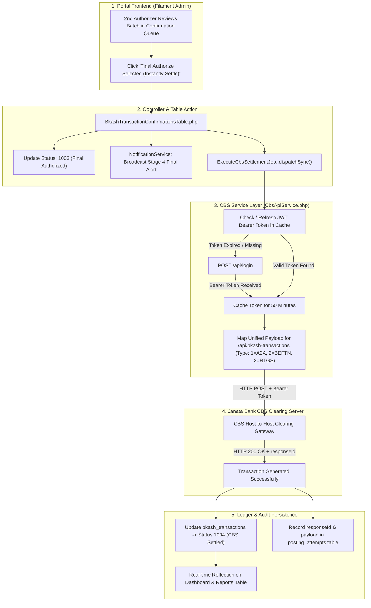

# Janata Bank Corporate Payment Portal
## Enterprise bKash Automated Host-to-Host (H2H) Payment Settlement System

An enterprise-grade automated payment settlement portal engineered for **Janata Bank PLC.** to ingest, validate, multi-tier authorize, and execute instant Host-to-Host (H2H) settlements for **bKash Limited** across **Account to Account (A2A)**, **BEFTN**, and **RTGS** channels.

---

## 📌 1. Executive Summary & Core Requirements Matrix

| Requirement Dimension | Business Specification | Architectural Implementation |
| :--- | :--- | :--- |
| **Phase-by-Phase H2H Rollout** | Phase 1: A2A (7 days/week) $\rightarrow$ Phase 2: BEFTN $\rightarrow$ Phase 3: RTGS | Configurable channel pipelines with dynamic tabs and dedicated validation rules |
| **SFTP 15-Min File Ingestion** | Fetch instruction files every 15 minutes, 7 days a week from designated source folders | Automated `sftp:fetch-bkash-files` cron job scanning `/Account-to-Account`, `/BEFTN`, `/RTGS` |
| **Dual Source File Formats** | Multi-Bank Tool (`.xls`) and Oracle ERP (`.xlsx`) | Cell-by-cell string preservation via `PhpSpreadsheet` & `IOFactory` parser |
| **Value Date & Holiday Processing** | Accurate calendar/value date visibility for post-banking hours & holiday runs | Database `value_date` column tracking execution vs settlement dates |
| **MT940 SWIFT Statements** | SWIFT MT940 statement delivery to SFTP for TCSA & Ops accounts | `Mt940GeneratorService` generating `:20:`, `:25:`, `:28C:`, `:60F:`, `:61:`, `:86:`, `:62F:` formatted `.sta` files |
| **3-Tier Segregation of Duties** | bKash Checker $\rightarrow$ 1st Authorizer $\rightarrow$ 2nd Authorizer (Final CBS Settlement) | Strict 3-person segregation lifecycle (`1000` $\rightarrow$ `1001` $\rightarrow$ `1002` $\rightarrow$ `1003` $\rightarrow$ `1004` CBS Settled) |
| **CBS / BACH API Integration** | Real-time Host-to-Host settlement via REST APIs (A2A, BEFTN, RTGS) | `CbsApiService` with automated JWT Bearer token management and `ExecuteCbsSettlementJob` |
| **CBS Response Callback API** | Real-time asynchronous settlement confirmations & failure reporting from CBS | Inbound callback handler (`POST /api/cbs/response-callback`) secured via `X-CBS-API-Key` |
| **Multi-Stage Role-Scoped Alerts** | Broadcast exact SMS & Email templates across 4 journey stages with role scoping | `NotificationService` broadcasting to scoped roles with BDT Lakh/Crore comma formatting |
| **Mobile OTP Password Reset** | 4-step mobile OTP verification with temporary password and rate limiting | Dedicated auth flow with 5-min TTL OTP and 15-min lockout after 5 failed attempts |
| **Line-Item Bank Statement** | Single debit line items per transaction (No bulk/consolidated debits) | Individual CBS host-to-host debit-credit posting entries per row |
| **Central Bank Routing** | Share `reference_id` instead of `txn_id` with Bangladesh Bank for BEFTN/RTGS | Gateway payload transformer swapping transaction keys for external clearing |

---

## 🔌 2. CBS / BEFTN / RTGS / A2A API Architecture

The portal features an automated **`CbsApiService`** client that interfaces with the Bank's Host-to-Host clearing server:

### Architectural Workflow



---

### Field Mapping Matrix

| Postman Field | Database Column | Service Mapping (`CbsApiService.php`) | Description |
| :--- | :--- | :--- | :--- |
| `uniqueId` | `txn_id` / `reference_id` | `(string) ($txn->txn_id ?: $txn->reference_id)` | Unique global transaction identifier |
| `debitAccount` | `credit_account_no` | `(string) $txn->credit_account_no` | bKash TCSA / Ops Account (Source/Debit) |
| `creditAccount` | `debit_account_no` | `(string) $txn->debit_account_no` | Beneficiary bank account number (Destination/Credit) |
| `creditAccountTitle` | `debit_account_title` | `(string) $txn->debit_account_title` | Beneficiary account title |
| `creditRoutingNo` | `debit_routing` | `(string) ($txn->debit_routing ?: $txn->credit_routing)` | Beneficiary bank 9-digit routing number |
| `amount` | `amount` | `(float) $txn->amount` | Monetary value in BDT |
| `remarks` | — | `"bKash {$txn->transaction_type} Settlement - Ref: {$txn->reference_id}"` | Transaction narrative description |
| `type` | `transaction_type` | `1` for A2A, `2` for BEFTN, `3` for RTGS | API channel routing code |

> [!NOTE]
> Due to historical schema design, `credit_account_no` stores the bKash TCSA/Operational (source/debit) account, while `debit_account_no` stores the beneficiary (destination/credit) account — this naming is inverted from its literal meaning but is used consistently throughout the codebase. See inline code comments in `BkashExcelParserService.php` and `BkashTransaction.php` for details.

---

### API Endpoints Reference

#### 1. Authentication (`POST /api/login`)
- **Endpoint**: `{BASE_URL}/api/login`
- **Request Body**:
  ```json
  {
      "username": "<API_USERNAME>",
      "password": "<API_PASSWORD>"
  }
  ```
- **Response**: Returns JWT Bearer token cached in local cache store for 50 minutes.

#### 2. Unified Settlement Gateway (`POST /api/bkash-transactions`)
- **Endpoint**: `{BASE_URL}/api/bkash-transactions`
- **Headers**: `Authorization: Bearer {token}`
- **Request Payload**:
  ```json
  {
      "uniqueId": "BKS2026XXXXXXXX",
      "debitAccount": "0100XXXXXXXXX",
      "creditAccount": "4512XXXXXXXXX",
      "creditAccountTitle": "BENEFICIARY_ACCOUNT_TITLE",
      "creditRoutingNo": "315XXXXXX",
      "amount": 500.00,
      "remarks": "bKash BEFTN Settlement - Ref: RM41107",
      "type": 2
  }
  ```
- **Response Example**:
  ```json
  {
      "responseCode": 200,
      "message": "Transaction Generated Successfully!",
      "uniqueId": "BKS2026XXXXXXXX",
      "responseId": "B135XXXXXXXXXXXX"
  }
  ```

---

## 🔄 3. CBS Response Callback API (Inbound)

Janata Bank CBS sends asynchronous transaction settlement confirmations and status updates via callback webhook:

- **Endpoint**: `POST /api/cbs/response-callback`
- **Authentication**: `X-CBS-API-Key` request header (verified against `config('bkash.cbs_callback_api_key')`)
- **Request Payload**:
  ```json
  {
      "response_id": "CBS_RESP_99881234",
      "status_id": 1006,
      "txn_id": "TXN_BKS_20260831_001",
      "confirmed_by": "CBS_AUTO_ENGINE",
      "reason": null
  }
  ```
- **Status Lifecycle Codes**:
  - `1006` (`STATUS_CBS_RESPONSE_SUCCESS`): Confirms successful posting in CBS core ledger.
  - `1007` (`STATUS_CBS_RESPONSE_FAILED`): Flags failure, records reject reason, and logs into `bkash_failed_transactions`.
- **Development / Staging Test Route**:
  - `POST /api/test-auth/token` $\rightarrow$ Returns temporary Sanctum bearer token.
  - `POST /api/test-auth/cbs/response-callback` $\rightarrow$ Executes test callback with Bearer token.
  - *(Safety Note: Test commands and test-auth routes are disabled in production environments).*

---

## 🔐 4. Password Reset — Mobile OTP Flow

The portal provides an enterprise mobile-based OTP verification and password recovery flow:

1. **Step 1: Forgot Password Request (`/admin/forgot-password`)**
   - User inputs registered 11-digit mobile number (`01XXXXXXXXX`).
   - System generates a 6-digit numeric OTP (5-minute TTL) and dispatches via Janata Bank SMS Gateway.
2. **Step 2: OTP Verification (`/admin/verify-otp`)**
   - User enters OTP. Enforces rate-limiting: maximum 5 failed attempts before 15-minute account lockout.
   - On successful verification, system generates a secure temporary password (`Temp@XXXX`) and sends via SMS.
3. **Step 3: Enter Temporary Password (`/admin/enter-temp-password`)**
   - User inputs the SMS-delivered temporary credentials to authenticate session.
4. **Step 4: Set New Password (`/admin/set-new-password`)**
   - User provides new password meeting banking complexity requirements (minimum 8 characters, uppercase, lowercase, numbers, symbols).
   - Updates hashed password, automatically logs user in, and redirects to Dashboard.

---

## 🛠️ 5. Validation & Business Logic Engine

1. **Strict 3-Person Segregation of Duties**:
   - `STATUS_PENDING_CHECKER` (`1000`): Ingested files pending Checker verification.
   - `STATUS_CHECKED` (`1001`): Verified by Checker, awaiting 1st Authorizer.
   - `STATUS_AUTH_1_APPROVED` (`1002`): Approved by 1st Authorizer, awaiting 2nd Authorizer.
   - `STATUS_FINAL_AUTHORIZED` (`1003`): Final-approved by 2nd Authorizer, queued for CBS.
   - `STATUS_CBS_SUCCESS` (`1004`): Real-time CBS Host-to-Host posting succeeded.
   - `STATUS_CBS_RESPONSE_SUCCESS` (`1006`): Asynchronous CBS settlement confirmed.
   - `STATUS_CBS_RESPONSE_FAILED` (`1007`): CBS settlement failed.
   - *System enforces that Checker, 1st Authorizer, and 2nd Authorizer must be three distinct bank officers; self-approval across stages is strictly blocked.*
2. **File Uniqueness**: Enforces SHA256 integrity hash & file name uniqueness matching naming conventions:
   - **A2A**: `JANATA_BANK_YYYY_MM_DD_xSloty.xlsx`
   - **BEFTN**: `BEFTN_JANATA_BANK_YYYY_MM_DD_xSloty.xlsx`
   - **RTGS**: `RTGS_JANATA_BANK_YYYY_MM_DD_xSloty.xlsx` *(where x, y are integer slot numbers)*
3. **Single Debit Account Rule**: Every single transaction inside a file must originate from the exact same debit account (`credit_account_no`), which must strictly belong to either bKash **Trust Cum Settlement Account** or **Operational Account**.
4. **Global `txn_id` Uniqueness**: Cross-checks `txn_id` against the historical ledger while explicitly allowing duplicate accounts inside a single file.
5. **RTGS Threshold Enforcement**: Mandatory rule requiring `amount >= 100,000 BDT` for RTGS transactions.
6. **Partial Processing Protocol**: Erroneous or dormant account rows are automatically isolated into `bkash_failed_transactions` with clear `reject_reason` descriptions, while all valid rows settle instantly without manual bank intervention.

---

## 📐 6. Database Schema & Field Mapping

| Field Label | Database Column (`snake_case`) | Data Type | Functional Description |
| :--- | :--- | :--- | :--- |
| **Ref / Ref No** | `reference_id` | `VARCHAR(255)` | Instruction reference number (Sent to Bangladesh Bank) |
| **Date / Execution Date** | `create_date` | `TIMESTAMP` | File creation / Execution timestamp |
| **Value Date** | `value_date` | `DATE` | Value date for holiday and post-banking hours settlement |
| **Return Date** | `return_date` | `TIMESTAMP` | EFT Return timestamp |
| **Bank Account Name** | `debit_account_title` | `VARCHAR(150)` | Beneficiary account title |
| **Bank Account No** | `debit_account_no` | `VARCHAR(100)` | Beneficiary account number |
| **Amount / Amount(BDT)** | `amount` | `DECIMAL(18,2)` | Monetary value in BDT (2 decimal places) |
| **Routing Number** | `debit_routing` | `VARCHAR(20)` | 9-digit routing code |
| **Bank Name** | `credit_routing` | `VARCHAR(100)` | Beneficiary bank name |
| **Branch Name** | `credit_bank` | `VARCHAR(255)` | Beneficiary branch name |
| **Debit Account** | `credit_account_no` | `VARCHAR(100)` | Sender Account (bKash TCSA / Operational Account) |
| **Txn ID** | `txn_id` | `VARCHAR(100)` | Unique global transaction identifier |
| **Reject Reason** | `reject_reason` | `TEXT` | Failure cause description for partial processing |
| **Status ID** | `status_id` | `INTEGER` | Lifecycle state (`1000`, `1001`, `1002`, `1003`, `1004`, `1006`, `1007`) |
| **Audit Logs** | `created_by`, `checked_by`, `approved_by_1`, `approved_by_2` | `VARCHAR(255)` | User action audit tracking |
| **Audit Timestamps** | `checked_at`, `approved_at_1`, `approved_at_2`, `cbs_success_at`, `confirmed_at` | `TIMESTAMP` | State transition audit timestamps |

---

## 📲 7. Multi-Stage Notification Journey (SMS & Email Templates)

All notifications format monetary values with standard comma separation (e.g., `1,56,100.82`):

- **Stage 1 (SFTP File Ingestion Complete):**
  > "Dear Sir/Madam, File Name: “{file_name}” Total Trn: “{total_count}”, Total Amount: “{amount}”. File is pending for Checker. Please Check this file. Thank you. Best Regards, JANATA BANK"
  - **Recipients**: Users with `bkash_checker` role.
- **Stage 2 (Checked by bKash Checker):**
  > "Dear Sir/Madam, File Name: “{file_name}” Total Trn: “{total_count}”, Total Amount: “{amount}” is checked by “{checker_name}” & is pending for further Authorization/Approval. Thank you. JANATA BANK"
  - **Recipients**: Users with `bkash_checker` and `bkash_authorizer_1` roles (excluding acting checker).
- **Stage 3 (Authorized by 1st Authorizer):**
  > "Dear Sir/Madam, File Name: “{file_name}” Total Trn: “{total_count}”, Total Amount: “{amount}” is Authorized by “{authorizer_1_name}” & is pending for further Authorization/Approval or final authorization. Thank you. JANATA BANK"
  - **Recipients**: Users with `bkash_checker`, `bkash_authorizer_1`, and `bkash_authorizer_2` roles (excluding acting 1st authorizer).
- **Stage 4 (Authorized by 2nd Authorizer - Finalized):**
  > "Dear Sir/Madam, File Name: “{file_name}” Total Trn: “{total_count}”, Total Amount: “{amount}” is Authorized by “{authorizer_2_name}” & is finally authorized. Thank you. JANATA BANK"
  - **Recipients**: Users with `bkash_checker`, `bkash_authorizer_1`, and `bkash_authorizer_2` roles (excluding acting 2nd authorizer).

---

## 🗺️ 8. Portal Navigation & UX Architecture

```
├── Dashboard (Live TCSA & Operational Balance, Auto-Refresh every 15s toggleable, 3-Tier Action Cards + 3-Channel Breakdown)
├── Transaction Pipeline
│   ├── Checker - Verify Files (Bulk Excel File Upload + Checker Verification Queue)
│   ├── Transaction Authorization (1st Authorizer Approval Queue)
│   └── Transaction Confirmation (2nd/Final Authorizer Approval Queue → CBS Instant Settlement)
├── Audits & Reports
│   ├── Batch File History (Comprehensive Ingestion Log & Settlement Overview)
│   ├── Transaction Process & EFT Reports (Daily/Weekly/Monthly/Yearly Download Dropdown)
│   ├── Failed Transaction Report (Dormant/Error Isolation with CBS response failure reasons)
│   └── EFT Return Report (Returned transaction audit log)
└── Administration
    ├── Organizations (bKash Corporate Profile & Account Tags)
    ├── Users (RBAC for bKash Checkers & Authorizers)
    └── Roles & Permissions (Filament Shield Multi-Tier Permission Matrix)
```

---

## 🚀 9. Setup & Execution Commands

```bash
# 1. Run Database Migrations
php artisan migrate

# 2. Clear & Optimize Application Caches
php artisan optimize:clear

# 3. Execute SFTP Automated File Ingestion Cron Job
php artisan sftp:fetch-bkash-files

# 4. Start Local Development Server
composer run dev
```

Visit the portal locally at:
👉 **`http://127.0.0.1:8000/admin`** or **`http://127.0.0.1:8001/admin`**

---

## 🔑 10. Environment Variables Reference

| Variable | Default | Description |
|:---------|:--------|:------------|
| `DB_CONNECTION` | `oracle` | Primary database driver |
| `SESSION_DRIVER` | `file` | Session storage driver |
| `CACHE_STORE` | `file` | Application cache driver |
| `BKASH_CBS_API_BASE_URL` | — | CBS Host-to-Host API base URL |
| `BKASH_CBS_API_USERNAME` | — | CBS API username |
| `BKASH_CBS_API_PASSWORD` | — | CBS API password |
| `CBS_CALLBACK_API_KEY` | `cbs-secret-callback-key-2026` | Inbound CBS response callback shared API key |
| `BKASH_SFTP_HOST` | — | SFTP server host/IP |
| `BKASH_SFTP_USERNAME` | — | SFTP login username |
| `BKASH_SFTP_PASSWORD` | — | SFTP login password |
| `BKASH_SFTP_PORT` | `22` | SFTP port |
| `BKASH_EMAIL_ENABLED` | `true` | Enable/disable email notifications |
| `BKASH_SMS_ENABLED` | `true` | Enable/disable SMS notifications |
| `BKASH_WHITELISTED_DEBIT_ACCOUNTS` | — | Allowed debit accounts |
| `BKASH_RTGS_MIN_LIMIT` | `100000` | Minimum RTGS amount (BDT) |
| `BKASH_TCSA_INITIAL_BALANCE` | — | TCSA account opening balance |
| `BKASH_OPS_INITIAL_BALANCE` | — | Ops account opening balance |

---

## ✅ 11. Testing & Quality Assurance

Run the comprehensive PHPUnit test suite from the terminal:

```bash
php artisan test
```

### Test Suite Coverage
- **3-Tier Workflow Segregation of Duties**: Enforces distinct user role constraints for Checker, 1st Authorizer, and 2nd Authorizer.
- **Role-Scoped Multi-Stage Notifications**: Verifies correct recipient scoping and template generation across stages 1 through 4.
- **CBS Host-to-Host & Response Callback API**: Tests token lifecycle, settlement dispatch, and callback processing.
- **Real-Time Dashboard Calculations**: Validates TCSA live balance, urgency action indicators, channel status cards, and MT940 logs.
- **Sidebar Accordion & Navigation UX**: Ensures single-expanded group accordion behavior and automatic collapse on top-level navigation.
- **Production Safety Guards**: Validates that all test/demo CLI commands reject execution in production environments.
