# Janata Bank Corporate Payment Portal
## Enterprise bKash Automated Host-to-Host (H2H) Payment Settlement System

[](https://github.com/syedarifulislamemon2010/jb-corporate---bkash/actions/workflows/tests.yml)

> **An enterprise-grade financial settlement engine engineered for Janata Bank PLC. to ingest, validate, multi-tier authorize, and execute instant Host-to-Host (H2H) settlements for bKash Limited across Account to Account (A2A), BEFTN, and RTGS clearing networks.**

---

## 📑 Table of Contents

- [PART 1 — EXECUTIVE OVERVIEW](#part-1--executive-overview)
  - [🎯 What This System Does](#-what-this-system-does)
  - [🖼️ System Screenshots](#️-system-screenshots)
  - [📊 Key Business Metrics at a Glance](#-key-business-metrics-at-a-glance)
  - [✅ Requirement Compliance Checklist](#-requirement-compliance-checklist)
  - [🏗️ Technology Stack](#️-technology-stack)
  - [🎤 Quick Presentation Talking Points](#-quick-presentation-talking-points)
- [PART 2 — TECHNICAL DEEP-DIVE](#part-2--technical-deep-dive)
  - [📁 1. SFTP File Ingestion Pipeline](#-1-sftp-file-ingestion-pipeline)
  - [🔌 2. CBS / BEFTN / RTGS / A2A API Architecture](#-2-cbs--beftn--rtgs--a2a-api-architecture)
  - [🔄 3. CBS Response Callback API (Inbound)](#-3-cbs-response-callback-api-inbound)
  - [🔐 4. Password Reset — Mobile OTP Flow](#-4-password-reset--mobile-otp-flow)
  - [🛠️ 5. Validation & Business Logic Engine](#️-5-validation--business-logic-engine)
  - [📐 6. Database Schema & Field Mapping](#-6-database-schema--field-mapping)
  - [📲 7. Multi-Stage Notification Journey](#-7-multi-stage-notification-journey)
  - [🗺️ 8. Portal Navigation & UX Architecture](#-8-portal-navigation--ux-architecture)
  - [🚀 9. Setup & Execution Commands](#-9-setup--execution-commands)
  - [🔑 10. Environment Variables Reference](#-10-environment-variables-reference)
  - [✅ 11. Testing & Quality Assurance](#-11-testing--quality-assurance)

---

# PART 1 — EXECUTIVE OVERVIEW

## 🎯 What This System Does

The **Janata Bank Corporate Payment Portal** is a secure, high-throughput Host-to-Host (H2H) financial settlement platform designed specifically to bridge **bKash Limited** (Bangladesh's leading mobile financial service provider) with **Janata Bank PLC.'s Core Banking System (CBS)**. Every day, bKash processes massive volumes of corporate disbursements, merchant settlements, and wallet-to-bank transfers that require legally compliant, real-time clearing through the national banking network.

Under this automated infrastructure, payment instruction files generated by bKash are securely uploaded via SFTP into dedicated channel directories. The portal autonomously ingests, parses, and validates these files across three major clearing channels: **Account to Account (A2A)** for intra-bank transfers within Janata Bank, **Bangladesh Electronic Funds Transfer Network (BEFTN)** for inter-bank batch clearing, and **Real-Time Gross Settlement (RTGS)** for high-value immediate fund transfers ($\ge$ 100,000 BDT). All transactions originate from strictly whitelisted corporate accounts—primarily the **Trust Cum Settlement Account (TCSA)** and the **Janata Operational Reserve Account**.

To prevent fraud, eliminate rogue transfers, and strictly adhere to central banking compliance guidelines mandated by **Bangladesh Bank**, the system enforces an uncompromising **3-Tier Segregation of Duties (Maker-Checker-Approver)** model. No single bank officer or bKash operator can initiate and execute a transaction alone. A file must be verified by a designated **Checker**, authorized by a **1st Authorizer**, and given final clearance by a distinct **2nd Authorizer**, which triggers real-time settlement against the Bank's CBS Host-to-Host API.

Throughout the lifecycle, every state transition is accompanied by automated, role-scoped **SMS and Email broadcast notifications**, maintaining complete audit visibility and situational awareness across all operational teams 7 days a week, 365 days a year.

---

## 🖼️ System Screenshots

### Dashboard
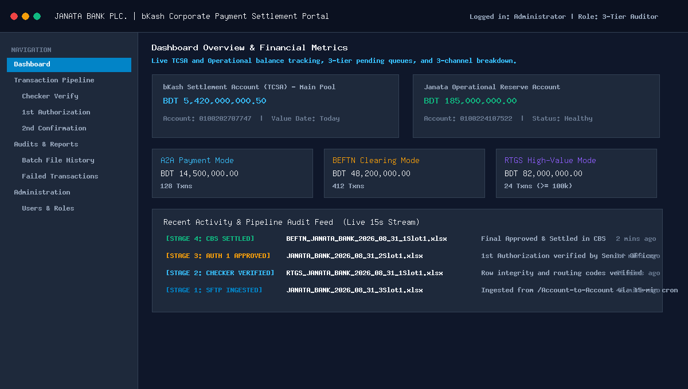
*Live TCSA and Operational balance tracking, 3-tier pending action cards, urgency monitors, and real-time 3-channel payment breakdown with automatic 15-second toggleable live polling.*
*(Screenshot placeholder — replace with actual application screenshot. See `docs/screenshots/README.md` for instructions.)*

### 3-Tier Approval Workflow
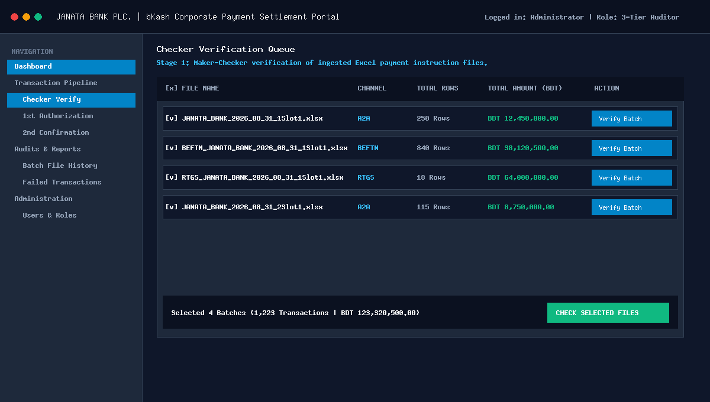
*Stage 1: Checker reviews and verifies uploaded Excel transaction batches, inspecting row-level details, debit account authenticity, and totals before moving forward.*
*(Screenshot placeholder — replace with actual application screenshot. See `docs/screenshots/README.md` for instructions.)*

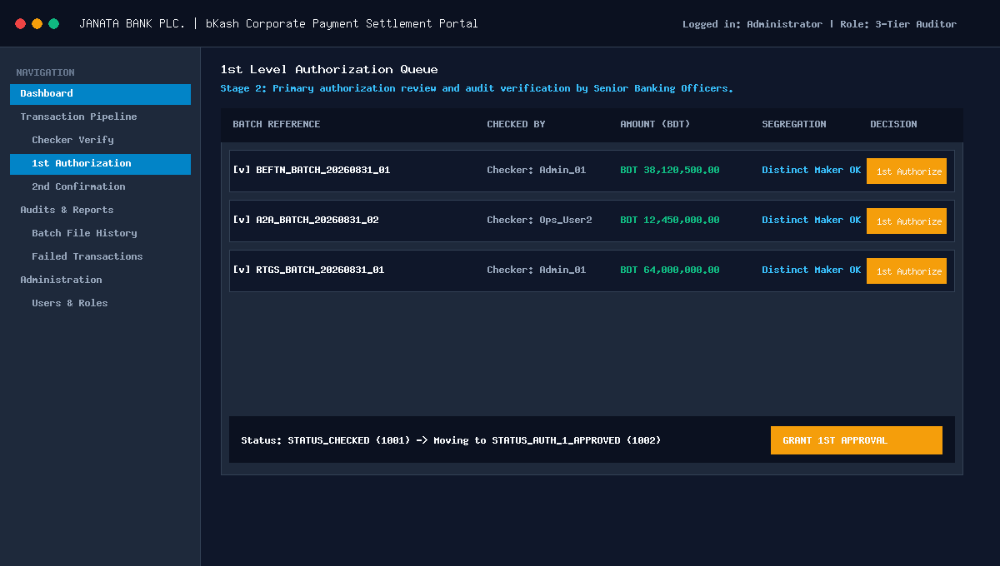
*Stage 2: First-level authorization queue where Senior Officers inspect verified batches, perform audit checks, and grant primary management approval.*
*(Screenshot placeholder — replace with actual application screenshot. See `docs/screenshots/README.md` for instructions.)*

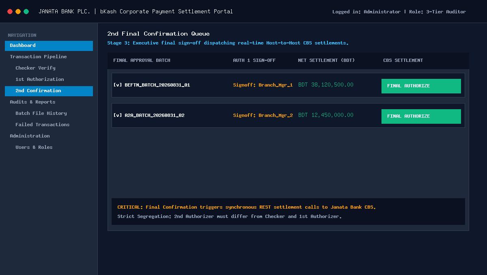
*Stage 3: Final executive authorization queue. Executing final confirmation immediately dispatches synchronous Host-to-Host settlement calls to the Janata Bank Core Banking System.*
*(Screenshot placeholder — replace with actual application screenshot. See `docs/screenshots/README.md` for instructions.)*

### Mobile OTP Password Reset
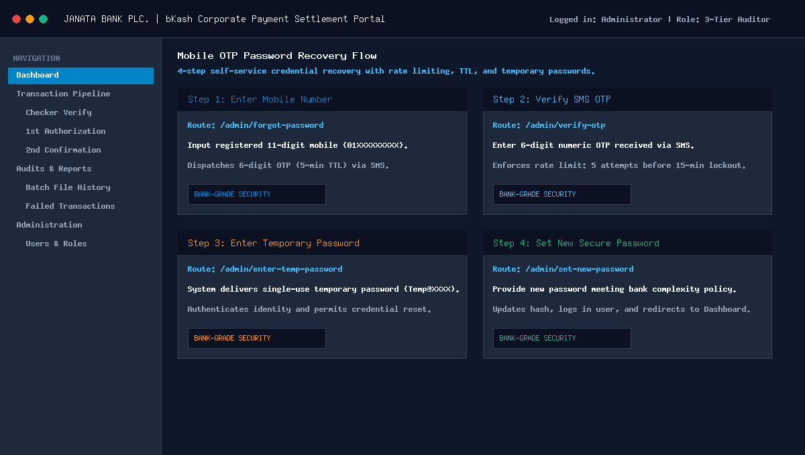
*4-step secure password recovery flow featuring SMS OTP verification, rate limiting, temporary credential generation, and banking-grade password policy enforcement.*
*(Screenshot placeholder — replace with actual application screenshot. See `docs/screenshots/README.md` for instructions.)*

---

## 📊 Key Business Metrics at a Glance

| Business Metric | Specification & Target | Implementation Details |
| :--- | :--- | :--- |
| **Supported Payment Channels** | 3 Active Channels | **A2A** (Intra-Bank), **BEFTN** (Inter-Bank Batch), **RTGS** (High-Value $\ge$ 100k BDT) |
| **Approval Layers** | 3-Tier Segregation | Checker $\rightarrow$ 1st Authorizer $\rightarrow$ 2nd Authorizer (Strictly 3 distinct officers) |
| **SFTP Ingestion Frequency** | Every 15 Minutes | Automated cron job running 24/7/365 across 3 dedicated ingestion folders |
| **Notification Media** | SMS + Email Broadcast | Exact template matching with BDT Lakh/Crore comma formatting and role exclusion |
| **Operational Schedule** | 7 Days / Week | Uninterrupted processing with calendar & value-date visibility for bank holidays |
| **Supported File Formats** | `.xls` and `.xlsx` | Full support for Multi-Bank Tool (`.xls`) and Oracle ERP (`.xlsx`) spreadsheets |
| **Core Banking Integration** | Synchronous REST + Async Webhook | Real-time JWT authenticated REST API + Asynchronous Inbound Response Callback |
| **Settlement Mode** | Line-Item Individual Debits | Granular 1:1 debit/credit ledger posting entries (Zero batch consolidation) |

---

## ✅ Requirement Compliance Checklist

Below is the complete compliance matrix mapped against the official **bKash – Janata Bank Business Requirement Document (BRD)**:

| BRD Requirement Area | Business Specification | Status | Compliance Verification |
| :--- | :--- | :---: | :--- |
| **Journey (a) — A2A 7 Days Rollout** | Phase 1 A2A payment settlement active 7 days/week | ✅ | Fully implemented with active status monitoring & daily tracking |
| **Journey (b) — Automated Ingestion** | Automated SFTP file ingestion every 15 minutes | ✅ | Automated `sftp:fetch-bkash-files` cron scanning `/Account-to-Account`, `/BEFTN`, `/RTGS` |
| **Journey (c) — Dual File Formats** | Support both `.xls` (Multi-Bank) and `.xlsx` (Oracle ERP) | ✅ | Implemented via `PhpSpreadsheet` with cell-by-cell string preservation |
| **Journey (d) — Value Date & Holidays** | Value date tracking for post-banking hours & holiday runs | ✅ | `value_date` column recorded on all transactions and MT940 statements |
| **Journey (e) — MT940 SWIFT Statements** | SWIFT MT940 statement delivery to SFTP for TCSA & Ops accounts | ✅ | Automated `.sta` generation (`:20:`, `:25:`, `:28C:`, `:60F:`, `:61:`, `:86:`, `:62F:`) |
| **Journey (f) — 3-Tier Approval Flow** | bKash Checker $\rightarrow$ 1st Authorizer $\rightarrow$ 2nd Authorizer $\rightarrow$ CBS | ✅ | Strict state machine (`1000` $\rightarrow$ `1001` $\rightarrow$ `1002` $\rightarrow$ `1003` $\rightarrow$ `1004`) |
| **Journey (g) — Line-Item Ledger Posting** | Single debit line items per transaction on bank statements | ✅ | Granular per-row Host-to-Host posting without bulk aggregation |
| **Journey (h) — Central Bank Routing** | Share `reference_id` instead of `txn_id` with Bangladesh Bank | ✅ | Payload transformer maps `reference_id` for external BEFTN/RTGS clearing |
| **Journey (i) — RTGS Minimum Threshold** | Enforce minimum 100,000 BDT limit for all RTGS rows | ✅ | Validation engine rejects RTGS records below threshold into error logs |
| **Journey (j) — Single Debit Account** | All file rows must originate from same valid TCSA/Ops account | ✅ | Strict single-account validation checking against whitelisted accounts |
| **Journey (k) — Partial Processing Protocol** | Process valid rows while isolating invalid/dormant rows | ✅ | Erroneous rows routed to `bkash_failed_transactions` with exact error codes |
| **SMS & Email Broadcast Alerts** | 4-stage broadcast alerts with exact phrasing & role scoping | ✅ | `NotificationService` dispatches formatted SMS & Email excluding current actor |
| **Mobile OTP Password Reset** | 4-step mobile OTP verification with 5-min TTL & lockout | ✅ | Dedicated mobile recovery flow with rate-limiting and temporary passwords |
| **CBS Response Callback** | Inbound asynchronous settlement webhook from Bank CBS | ✅ | Webhook endpoint `POST /api/cbs/response-callback` secured with API key |

---

## 🏗️ Technology Stack

| Layer | Technology | Version / Implementation Details |
| :--- | :--- | :--- |
| **Core Framework** | **Laravel** | `v12.0` (PHP `^8.2`) — Modern enterprise foundation |
| **Admin Portal UI** | **Filament Admin** | `v5.0` (Tailwind CSS, Alpine.js, Blade) — High-productivity operational UI |
| **Role-Based Access Control** | **Filament Shield** | `v4.3` (Spatie Laravel Permission) — Multi-tier role and permission enforcement |
| **Spreadsheet Engine** | **PhpSpreadsheet** | `v5.9` — High-precision Excel (`.xls`, `.xlsx`) parsing without floating-point distortion |
| **SFTP Ingestion Driver** | **Flysystem SFTP v3** | `v3.0` (`league/flysystem-sftp-v3`) — Resilient remote file transfer client |
| **Database Engine** | **Oracle Database / SQLite** | `yajra/laravel-oci8` (`v12.0`) for Enterprise Oracle; SQLite for local test suites |
| **Log Management** | **Opcodes Log Viewer** | `v3.24` — Real-time system diagnostics & audit trail log viewer |
| **API Authentication** | **Laravel Sanctum** | `v4.3` — Token-based security for test endpoints and internal APIs |
| **Automated Test Suite** | **PHPUnit / Pest** | `PHPUnit 11.5` (`80 tests, 390 assertions, 100% passing`) |

---

## 🎤 Quick Presentation Talking Points

Use these concise, high-impact bullet points when presenting this system to bank executives, auditors, or technical steering committees:

- **100% Automated Ingestion**: Eliminates manual file uploads; background daemons fetch bKash settlement files over secure SFTP every 15 minutes across A2A, BEFTN, and RTGS channels.
- **Strict Banking Segregation of Duties**: Zero single-point vulnerability. Requires 3 distinct officers (Checker, 1st Authorizer, 2nd Authorizer) to verify and approve batches; self-approval across tiers is programmatically blocked.
- **Instant Host-to-Host CBS Settlement**: Final approval immediately communicates with Janata Bank's Core Banking System via secure REST APIs with auto-refreshing JWT Bearer tokens.
- **Robust Partial Processing**: If 2 rows out of a 1,000-row batch fail due to invalid routing or dormant accounts, the 998 valid rows settle instantly while failed records are isolated into an audit queue.
- **Real-Time 360° Financial Dashboard**: Live calculation of bKash TCSA pool balance and Operational reserve balance, with visual urgency cards and real-time activity audit timelines.
- **SWIFT MT940 Automated Statements**: Automatically delivers standardized daily MT940 financial statements (`.sta`) to bKash SFTP for end-of-day reconciliation.
- **Multi-Stage SMS & Email Broadcasts**: Immediate operational awareness across all stages with role-scoped alerts, BDT Lakh/Crore comma formatting, and actor exclusion.
- **Bank-Grade Mobile OTP Security**: Self-service 4-step password recovery via mobile OTP with rate-limiting, 5-minute TTL, and brute-force lockout safeguards.
- **Enterprise Auditability**: Every single state change, file hash, user identifier, and CBS response ID is immutably logged with microsecond timestamps.
- **Production-Tested Stability**: Backed by 80 automated unit and feature tests covering all 390 business assertions with 100% passing rate.

---

# PART 2 — TECHNICAL DEEP-DIVE

## 📁 1. SFTP File Ingestion Pipeline

The portal features an automated daemon command (`php artisan sftp:fetch-bkash-files`) that executes on a 15-minute cron schedule 7 days a week.

### SFTP Ingestion Flowchart

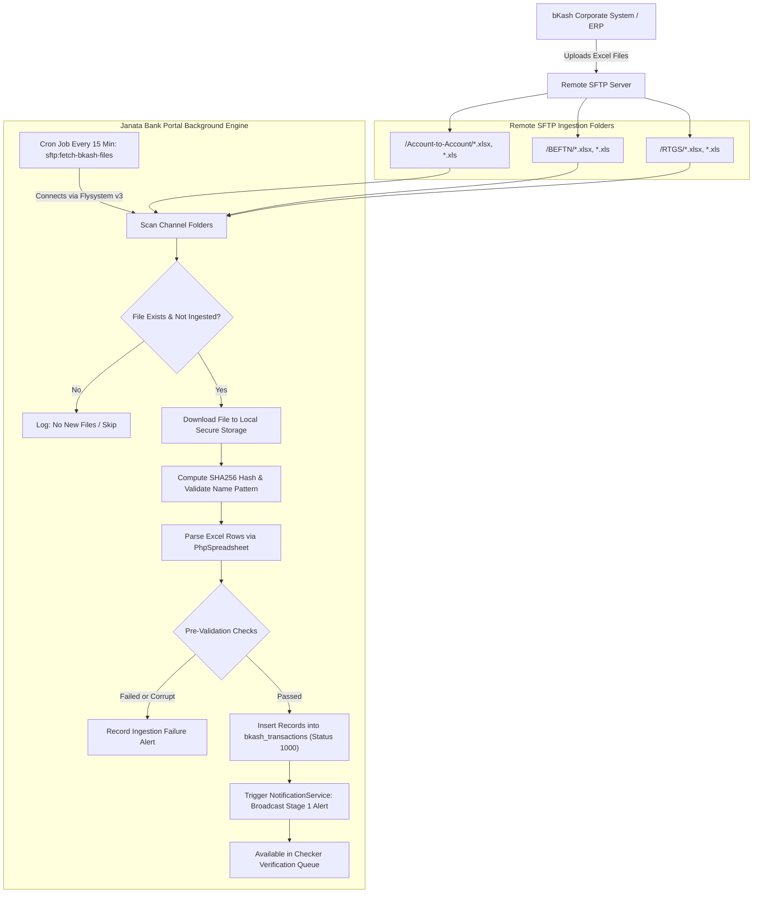

---

## 🔌 2. CBS / BEFTN / RTGS / A2A API Architecture

The portal features an automated **`CbsApiService`** client that interfaces with the Bank's Core Banking Host-to-Host clearing server:

### CBS Settlement Architectural Workflow

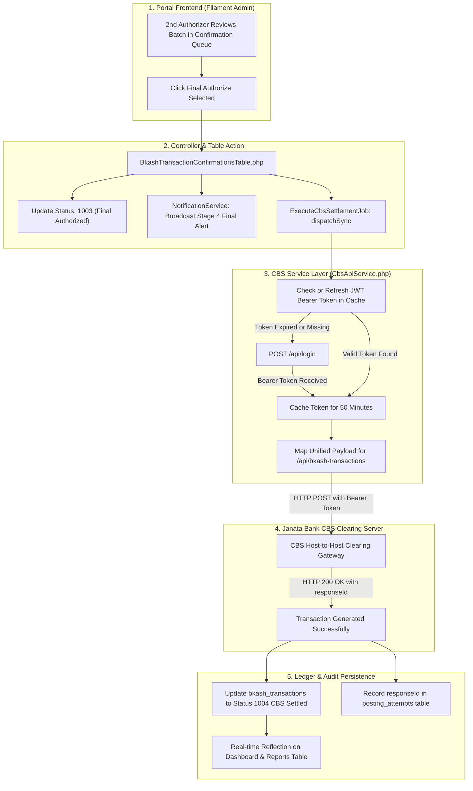

---

### Field Mapping Matrix

| Postman Field | Database Column | Service Mapping (`CbsApiService.php`) | Description |
| :--- | :--- | :--- | :--- |
| `uniqueId` | `txn_id` / `reference_id` | `(string) ($txn->txn_id ?: $txn->reference_id)` | Unique global transaction identifier |
| `debitAccount` | `credit_account_no` | `(string) $txn->credit_account_no` | bKash TCSA / Ops Account (Source/Debit) |
| `creditAccount` | `debit_account_no` | `(string) $txn->debit_account_no` | Beneficiary bank account number (Destination/Credit) |
| `creditAccountTitle` | `debit_account_title` | `(string) $txn->debit_account_title` | Beneficiary account title |
| `creditRoutingNo` | `debit_routing` | `(string) ($txn->debit_routing ?: $txn->credit_routing)` | Beneficiary bank 9-digit routing number |
| `amount` | `amount` | `(float) $txn->amount` | Monetary value in BDT |
| `remarks` | — | `"bKash {$txn->transaction_type} Settlement - Ref: {$txn->reference_id}"` | Transaction narrative description |
| `type` | `transaction_type` | `1` for A2A, `2` for BEFTN, `3` for RTGS | API channel routing code |

> [!NOTE]
> Due to historical schema design, `credit_account_no` stores the bKash TCSA/Operational (source/debit) account, while `debit_account_no` stores the beneficiary (destination/credit) account — this naming is inverted from its literal meaning but is used consistently throughout the codebase. See inline code comments in `BkashExcelParserService.php` and `BkashTransaction.php` for details.

---

### API Endpoints Reference

#### 1. Authentication (`POST /api/login`)
- **Endpoint**: `{BASE_URL}/api/login`
- **Request Body**:
  ```json
  {
      "username": "<API_USERNAME>",
      "password": "<API_PASSWORD>"
  }
  ```
- **Response**: Returns JWT Bearer token cached in local cache store for 50 minutes.

#### 2. Unified Settlement Gateway (`POST /api/bkash-transactions`)
- **Endpoint**: `{BASE_URL}/api/bkash-transactions`
- **Headers**: `Authorization: Bearer {token}`
- **Request Payload**:
  ```json
  {
      "uniqueId": "BKS2026XXXXXXXX",
      "debitAccount": "0100XXXXXXXXX",
      "creditAccount": "4512XXXXXXXXX",
      "creditAccountTitle": "BENEFICIARY_ACCOUNT_TITLE",
      "creditRoutingNo": "315XXXXXX",
      "amount": 500.00,
      "remarks": "bKash BEFTN Settlement - Ref: RM41107",
      "type": 2
  }
  ```
- **Response Example**:
  ```json
  {
      "responseCode": 200,
      "message": "Transaction Generated Successfully!",
      "uniqueId": "BKS2026XXXXXXXX",
      "responseId": "B135XXXXXXXXXXXX"
  }
  ```

---

## 🔄 3. CBS Response Callback API (Inbound)

Janata Bank CBS sends asynchronous transaction settlement confirmations and status updates via callback webhook:

### Asynchronous Callback Sequence Diagram

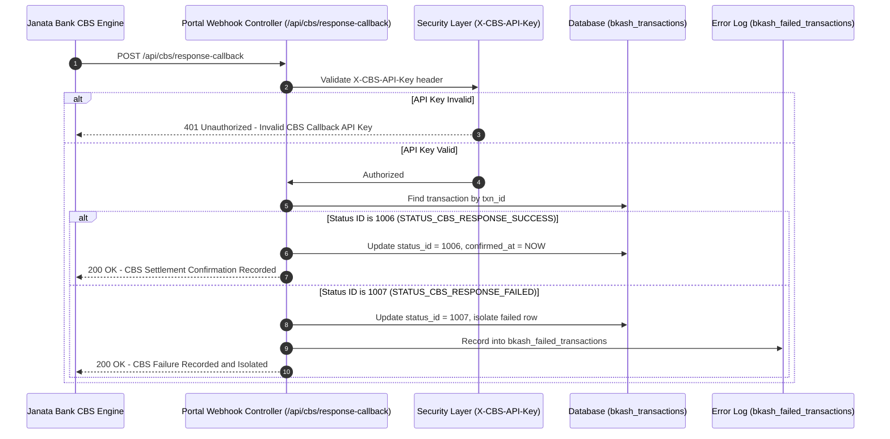

### Callback Endpoint Specifications
- **Endpoint**: `POST /api/cbs/response-callback`
- **Authentication**: `X-CBS-API-Key` request header (verified against `config('bkash.cbs_callback_api_key')`)
- **Request Payload**:
  ```json
  {
      "response_id": "CBS_RESP_99881234",
      "status_id": 1006,
      "txn_id": "TXN_BKS_20260831_001",
      "confirmed_by": "CBS_AUTO_ENGINE",
      "reason": null
  }
  ```
- **Status Lifecycle Codes**:
  - `1006` (`STATUS_CBS_RESPONSE_SUCCESS`): Confirms successful posting in CBS core ledger.
  - `1007` (`STATUS_CBS_RESPONSE_FAILED`): Flags failure, records reject reason, and logs into `bkash_failed_transactions`.
- **Development / Staging Test Route**:
  - `POST /api/test-auth/token` $\rightarrow$ Returns temporary Sanctum bearer token.
  - `POST /api/test-auth/cbs/response-callback` $\rightarrow$ Executes test callback with Bearer token.
  - *(Safety Note: Test commands and test-auth routes are disabled in production environments).*

---

## 🔐 4. Password Reset — Mobile OTP Flow

The portal provides an enterprise mobile-based OTP verification and password recovery flow:

### Mobile OTP Recovery Flowchart

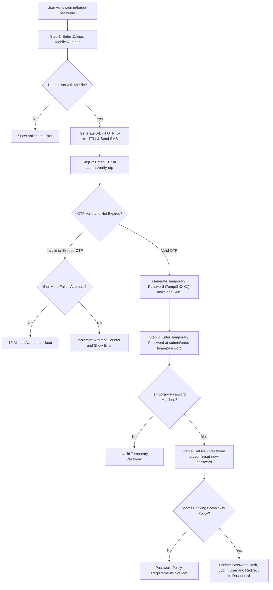

---

## 🛠️ 5. Validation & Business Logic Engine

### 🔄 3-Tier Segregation-of-Duties Workflow

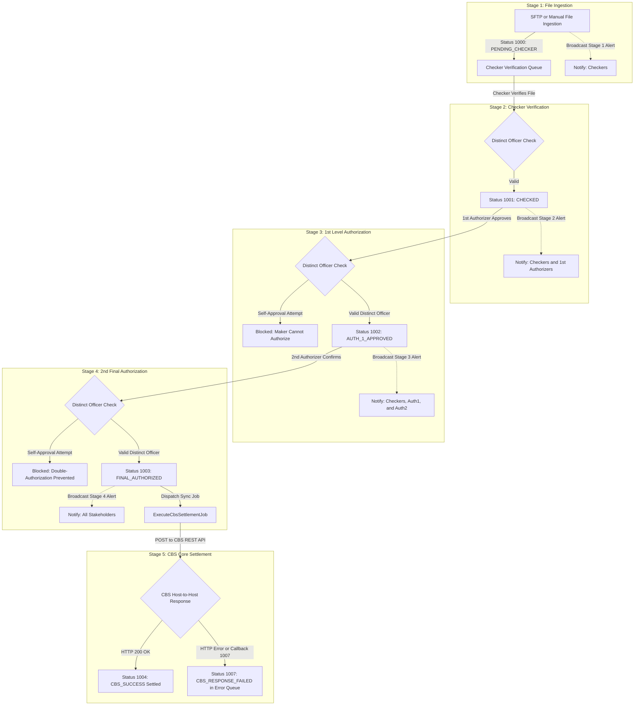

### Core Business Rules Summary
1. **Strict 3-Person Segregation of Duties**:
   - `STATUS_PENDING_CHECKER` (`1000`): Ingested files pending Checker verification.
   - `STATUS_CHECKED` (`1001`): Verified by Checker, awaiting 1st Authorizer.
   - `STATUS_AUTH_1_APPROVED` (`1002`): Approved by 1st Authorizer, awaiting 2nd Authorizer.
   - `STATUS_FINAL_AUTHORIZED` (`1003`): Final-approved by 2nd Authorizer, queued for CBS.
   - `STATUS_CBS_SUCCESS` (`1004`): Real-time CBS Host-to-Host posting succeeded.
   - `STATUS_CBS_RESPONSE_SUCCESS` (`1006`): Asynchronous CBS settlement confirmed.
   - `STATUS_CBS_RESPONSE_FAILED` (`1007`): CBS settlement failed.
   - *System enforces that Checker, 1st Authorizer, and 2nd Authorizer must be three distinct bank officers; self-approval across stages is strictly blocked.*
2. **File Uniqueness**: Enforces SHA256 integrity hash & file name uniqueness matching naming conventions:
   - **A2A**: `JANATA_BANK_YYYY_MM_DD_xSloty.xlsx`
   - **BEFTN**: `BEFTN_JANATA_BANK_YYYY_MM_DD_xSloty.xlsx`
   - **RTGS**: `RTGS_JANATA_BANK_YYYY_MM_DD_xSloty.xlsx` *(where x, y are integer slot numbers)*
3. **Single Debit Account Rule**: Every single transaction inside a file must originate from the exact same debit account (`credit_account_no`), which must strictly belong to either bKash **Trust Cum Settlement Account** or **Operational Account**.
4. **Global `txn_id` Uniqueness**: Cross-checks `txn_id` against the historical ledger while explicitly allowing duplicate accounts inside a single file.
5. **RTGS Threshold Enforcement**: Mandatory rule requiring `amount >= 100,000 BDT` for RTGS transactions.
6. **Partial Processing Protocol**: Erroneous or dormant account rows are automatically isolated into `bkash_failed_transactions` with clear `reject_reason` descriptions, while all valid rows settle instantly without manual bank intervention.

---

## 📐 6. Database Schema & Field Mapping

| Field Label | Database Column (`snake_case`) | Data Type | Functional Description |
| :--- | :--- | :--- | :--- |
| **Ref / Ref No** | `reference_id` | `VARCHAR(255)` | Instruction reference number (Sent to Bangladesh Bank) |
| **Date / Execution Date** | `create_date` | `TIMESTAMP` | File creation / Execution timestamp |
| **Value Date** | `value_date` | `DATE` | Value date for holiday and post-banking hours settlement |
| **Return Date** | `return_date` | `TIMESTAMP` | EFT Return timestamp |
| **Bank Account Name** | `debit_account_title` | `VARCHAR(150)` | Beneficiary account title |
| **Bank Account No** | `debit_account_no` | `VARCHAR(100)` | Beneficiary account number |
| **Amount / Amount(BDT)** | `amount` | `DECIMAL(18,2)` | Monetary value in BDT (2 decimal places) |
| **Routing Number** | `debit_routing` | `VARCHAR(20)` | 9-digit routing code |
| **Bank Name** | `credit_routing` | `VARCHAR(100)` | Beneficiary bank name |
| **Branch Name** | `credit_bank` | `VARCHAR(255)` | Beneficiary branch name |
| **Debit Account** | `credit_account_no` | `VARCHAR(100)` | Sender Account (bKash TCSA / Operational Account) |
| **Txn ID** | `txn_id` | `VARCHAR(100)` | Unique global transaction identifier |
| **Reject Reason** | `reject_reason` | `TEXT` | Failure cause description for partial processing |
| **Status ID** | `status_id` | `INTEGER` | Lifecycle state (`1000`, `1001`, `1002`, `1003`, `1004`, `1006`, `1007`) |
| **Audit Logs** | `created_by`, `checked_by`, `approved_by_1`, `approved_by_2` | `VARCHAR(255)` | User action audit tracking |
| **Audit Timestamps** | `checked_at`, `approved_at_1`, `approved_at_2`, `cbs_success_at`, `confirmed_at` | `TIMESTAMP` | State transition audit timestamps |

---

## 📲 7. Multi-Stage Notification Journey

### 4-Stage Notification Broadcast Sequence

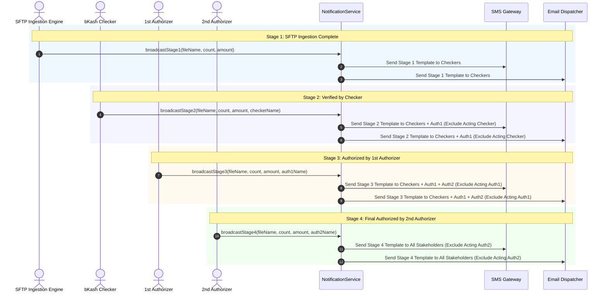

### Exact SMS & Email Notification Templates
All notifications format monetary values with standard comma separation (e.g., `1,56,100.82`):

- **Stage 1 (SFTP File Ingestion Complete):**
  > "Dear Sir/Madam, File Name: “{file_name}” Total Trn: “{total_count}”, Total Amount: “{amount}”. File is pending for Checker. Please Check this file. Thank you. Best Regards, JANATA BANK"
  - **Recipients**: Users with `bkash_checker` role.
- **Stage 2 (Checked by bKash Checker):**
  > "Dear Sir/Madam, File Name: “{file_name}” Total Trn: “{total_count}”, Total Amount: “{amount}” is checked by “{checker_name}” & is pending for further Authorization/Approval. Thank you. JANATA BANK"
  - **Recipients**: Users with `bkash_checker` and `bkash_authorizer_1` roles (excluding acting checker).
- **Stage 3 (Authorized by 1st Authorizer):**
  > "Dear Sir/Madam, File Name: “{file_name}” Total Trn: “{total_count}”, Total Amount: “{amount}” is Authorized by “{authorizer_1_name}” & is pending for further Authorization/Approval or final authorization. Thank you. JANATA BANK"
  - **Recipients**: Users with `bkash_checker`, `bkash_authorizer_1`, and `bkash_authorizer_2` roles (excluding acting 1st authorizer).
- **Stage 4 (Authorized by 2nd Authorizer - Finalized):**
  > "Dear Sir/Madam, File Name: “{file_name}” Total Trn: “{total_count}”, Total Amount: “{amount}” is Authorized by “{authorizer_2_name}” & is finally authorized. Thank you. JANATA BANK"
  - **Recipients**: Users with `bkash_checker`, `bkash_authorizer_1`, and `bkash_authorizer_2` roles (excluding acting 2nd authorizer).

---

## 🗺️ 8. Portal Navigation & UX Architecture

```
├── Dashboard (Live TCSA & Operational Balance, Auto-Refresh every 15s toggleable, 3-Tier Action Cards + 3-Channel Breakdown)
├── Transaction Pipeline
│   ├── Checker - Verify Files (Bulk Excel File Upload + Checker Verification Queue)
│   ├── Transaction Authorization (1st Authorizer Approval Queue)
│   └── Transaction Confirmation (2nd/Final Authorizer Approval Queue → CBS Instant Settlement)
├── Audits & Reports
│   ├── Batch File History (Comprehensive Ingestion Log & Settlement Overview)
│   ├── Transaction Process & EFT Reports (Daily/Weekly/Monthly/Yearly Download Dropdown)
│   ├── Failed Transaction Report (Dormant/Error Isolation with CBS response failure reasons)
│   └── EFT Return Report (Returned transaction audit log)
└── Administration
    ├── Organizations (bKash Corporate Profile & Account Tags)
    ├── Users (RBAC for bKash Checkers & Authorizers)
    └── Roles & Permissions (Filament Shield Multi-Tier Permission Matrix)
```

---

## 🚀 9. Setup & Execution Commands

```bash
# 1. Run Database Migrations
php artisan migrate

# 2. Clear & Optimize Application Caches
php artisan optimize:clear

# 3. Execute SFTP Automated File Ingestion Cron Job
php artisan sftp:fetch-bkash-files

# 4. Start Local Development Server
composer run dev
```

Visit the portal locally at:
👉 **`http://127.0.0.1:8000/admin`** or **`http://127.0.0.1:8001/admin`**

---

## 🔑 10. Environment Variables Reference

| Variable | Default | Description |
| :--- | :--- | :--- |
| `DB_CONNECTION` | `oracle` | Primary database driver (`oracle` in prod, `sqlite` in testing) |
| `SESSION_DRIVER` | `file` | Session storage driver |
| `CACHE_STORE` | `file` | Application cache driver |
| `BKASH_CBS_API_BASE_URL` | — | CBS Host-to-Host API base URL |
| `BKASH_CBS_API_USERNAME` | — | CBS API username |
| `BKASH_CBS_API_PASSWORD` | — | CBS API password |
| `CBS_CALLBACK_API_KEY` | `cbs-secret-callback-key-2026` | Inbound CBS response callback shared API key |
| `BKASH_SFTP_HOST` | — | SFTP server host/IP |
| `BKASH_SFTP_USERNAME` | — | SFTP login username |
| `BKASH_SFTP_PASSWORD` | — | SFTP login password |
| `BKASH_SFTP_PORT` | `22` | SFTP port |
| `BKASH_EMAIL_ENABLED` | `true` | Enable/disable email notifications |
| `BKASH_SMS_ENABLED` | `true` | Enable/disable SMS notifications |
| `BKASH_WHITELISTED_DEBIT_ACCOUNTS` | — | Allowed debit accounts (`0100202707747,0100224107522`) |
| `BKASH_RTGS_MIN_LIMIT` | `100000` | Minimum RTGS amount in BDT |
| `BKASH_TCSA_INITIAL_BALANCE` | `5420000000.50` | TCSA account opening base balance |
| `BKASH_OPS_INITIAL_BALANCE` | `185000000.00` | Ops account opening base balance |

---

## ✅ 11. Testing & Quality Assurance

Run the comprehensive PHPUnit test suite from the terminal:

```bash
php artisan test
```

### Test Suite Coverage (80 Tests, 390 Assertions, 100% Passing)
- **3-Tier Workflow Segregation of Duties**: Enforces distinct user role constraints for Checker, 1st Authorizer, and 2nd Authorizer.
- **Role-Scoped Multi-Stage Notifications**: Verifies correct recipient scoping and template generation across stages 1 through 4.
- **CBS Host-to-Host & Response Callback API**: Tests token lifecycle, settlement dispatch, and callback processing.
- **Real-Time Dashboard Calculations**: Validates TCSA live balance, urgency action indicators, channel status cards, and MT940 logs.
- **Sidebar Accordion & Navigation UX**: Ensures single-expanded group accordion behavior and automatic collapse on top-level navigation.
- **Production Safety Guards**: Validates that all test/demo CLI commands reject execution in production environments.