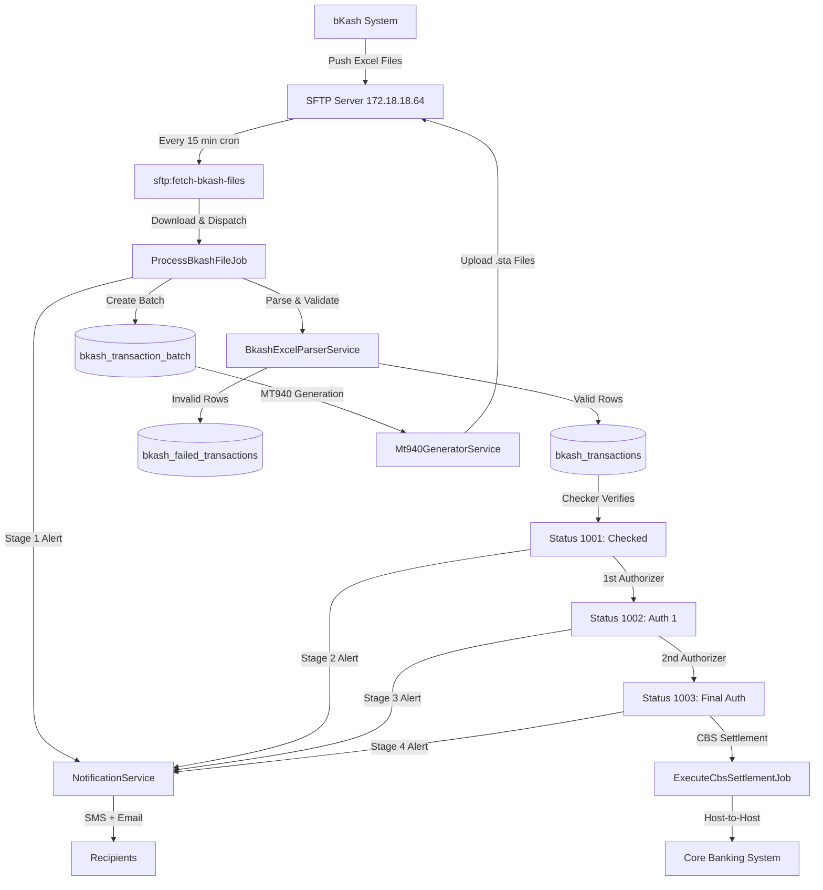

# Janata Bank Corporate Payment Portal
## Enterprise bKash Automated Host-to-Host (H2H) Payment Settlement System

A state-of-the-art, enterprise-grade automated payment settlement portal engineered for **Janata Bank PLC.** to ingest, validate, dual-authorize, and execute instant Host-to-Host (H2H) settlements for **bKash Limited** across **Account to Account (A2A)**, **BEFTN**, and **RTGS** channels.

---

## 📌 1. Executive Summary & Core Requirements Matrix

| Requirement Dimension | Business Specification | Architectural Implementation |
| :--- | :--- | :--- |
| **Phase-by-Phase H2H Rollout** | Phase 1: A2A (7 days/week) $\rightarrow$ Phase 2: BEFTN $\rightarrow$ Phase 3: RTGS | Configurable channel pipelines with dynamic tabs and dedicated validation rules |
| **SFTP 15-Min File Ingestion** | Fetch instruction files every 15 minutes, 7 days a week from 3 folders | Automated `sftp:fetch-bkash-files` cron job scanning `/Account-to-Account`, `/BEFTN`, `/RTGS` |
| **Dual Source File Formats** | Multi-Bank Tool (`.xls`) and Oracle ERP (`.xlsx`) | Cell-by-cell string preservation via `PhpSpreadsheet` & `IOFactory` parser |
| **Value Date & Holiday Processing** | Accurate calendar/value date visibility for post-banking hours & holiday runs | Database `value_date` column tracking execution vs settlement dates |
| **MT940 SWIFT Statements** | SWIFT MT940 statement delivery to SFTP for TCSA & Ops accounts | `Mt940GeneratorService` generating `:20:`, `:25:`, `:28C:`, `:60F:`, `:61:`, `:86:`, `:62F:` formatted `.sta` files |
| **Dual Signatory Workflow** | bKash Checker $\rightarrow$ 1st Authorizer $\rightarrow$ 2nd Authorizer (Final CBS Settlement) | Role-based status lifecycle (`1000` Pending $\rightarrow$ `1001` Checked $\rightarrow$ `1002` Auth 1 $\rightarrow$ `1004` CBS Settled) |
| **Multi-Stage SMS & Email Alerts** | Broadcast exact SMS & Email templates across 4 journey stages | `NotificationService` with BDT Lakh/Crore comma-formatted amounts and counts |
| **Line-Item Bank Statement** | Single debit line items per transaction (No bulk/consolidated debits) | Individual CBS host-to-host debit-credit posting entries per row |
| **Central Bank Routing** | Share `reference_id` instead of `txn_id` with Bangladesh Bank for BEFTN/RTGS | Gateway payload transformer swapping transaction keys for external clearing |

---

## 🛠️ 2. Validation & Business Logic Engine

1. **File Uniqueness**: Enforces SHA256 integrity hash & file name uniqueness matching naming conventions:
   - **A2A**: `JANATA_BANK_YYYY_MM_DD_xSloty.xlsx`
   - **BEFTN**: `BEFTN_JANATA_BANK_YYYY_MM_DD_xSloty.xlsx`
   - **RTGS**: `RTGS_JANATA_BANK_YYYY_MM_DD_xSloty.xlsx` *(where x, y are integer slot numbers)*
2. **Single Debit Account Rule**: Every single transaction inside a file must originate from the exact same debit account (`credit_account_no`), which must strictly belong to either bKash **Trust Cum Settlement Account (`0100202707747`)** or **Operational Account (`0100224107522`)**.
3. **Global `txn_id` Uniqueness**: Cross-checks `txn_id` against the historical ledger while explicitly allowing duplicate accounts inside a single file.
4. **RTGS Threshold Enforcement**: Mandatory rule requiring `amount >= 100,000 BDT` for RTGS transactions.
5. **Partial Processing Protocol**: Erroneous or dormant account rows are automatically isolated into `bkash_failed_transactions` with clear `reject_reason` descriptions, while all valid rows settle instantly without manual bank intervention.

---

## 📐 3. Database Schema & Field Mapping (Strict Compliance)

| Field Label | Database Column (`snake_case`) | Data Type | Functional Description |
| :--- | :--- | :--- | :--- |
| **Ref / Ref No** | `reference_id` | `VARCHAR(255)` | Instruction reference number (Sent to Bangladesh Bank) |
| **Date / Execution Date** | `create_date` | `TIMESTAMP` | File creation / Execution timestamp |
| **Value Date** | `value_date` | `DATE` | Value date for holiday and post-banking hours settlement |
| **Return Date** | `return_date` | `TIMESTAMP` | EFT Return timestamp |
| **Bank Account Name** | `debit_account_title` | `VARCHAR(150)` | Beneficiary account title |
| **Bank Account No** | `debit_account_no` | `VARCHAR(100)` | Beneficiary account number |
| **Amount / Amount(BDT)** | `amount` | `DECIMAL(18,2)` | Monetary value in BDT (2 decimal places) |
| **Routing Number** | `debit_routing` | `VARCHAR(20)` | 9-digit routing code |
| **Bank Name** | `credit_routing` | `VARCHAR(100)` | Beneficiary bank name |
| **Branch Name** | `credit_bank` | `VARCHAR(255)` | Beneficiary branch name |
| **Debit Account** | `credit_account_no` | `VARCHAR(100)` | Sender Account (bKash TCSA / Operational Account) |
| **Txn ID** | `txn_id` | `VARCHAR(100)` | Unique global transaction identifier |
| **Reject Reason** | `reject_reason` | `TEXT` | Failure cause description for partial processing |
| **Status ID** | `status_id` | `INTEGER` | Lifecycle state (`1000` Pending, `1001` Checked, `1002` Auth 1, `1004` Settled) |
| **Audit Logs** | `created_by`, `checked_by`, `approved_by_1`, `approved_by_2` | `VARCHAR(255)` | User action audit tracking |
| **Audit Timestamps** | `checked_at`, `approved_at_1`, `approved_at_2`, `cbs_success_at` | `TIMESTAMP` | State transition audit timestamps |

---

## 📲 4. Multi-Stage Notification Journey (SMS & Email Templates)

All notifications format monetary values with standard comma separation (e.g., `1,56,100.82`):

- **Stage 1 (SFTP File Ingestion Complete):**
  > "Dear Sir/Madam, File Name: “{file_name}” Total Trn: “{total_count}”, Total Amount: “{amount}”. File is pending for Checker. Please Check this file. Thank you. Best Regards, JANATA BANK"
- **Stage 2 (Checked by bKash Checker):**
  > "Dear Sir/Madam, File Name: “{file_name}” Total Trn: “{total_count}”, Total Amount: “{amount}” is checked by “{checker_name}” & is pending for further Authorization/Approval. Thank you. JANATA BANK"
- **Stage 3 (Authorized by 1st Authorizer):**
  > "Dear Sir/Madam, File Name: “{file_name}” Total Trn: “{total_count}”, Total Amount: “{amount}” is Authorized by “{authorizer_1_name}” & is pending for further Authorization/Approval or final authorization. Thank you. JANATA BANK"
- **Stage 4 (Authorized by 2nd Authorizer - Finalized):**
  > "Dear Sir/Madam, File Name: “{file_name}” Total Trn: “{total_count}”, Total Amount: “{amount}” is Authorized by “{authorizer_2_name}” & is finally authorized. Thank you. JANATA BANK"

---

## 🗺️ 5. Portal Navigation & UX Architecture

```
├── Dashboard (Live TCSA 0100202707747 & Operational 0100224107522 Account Balance Widgets)
├── Transaction Pipeline
│   ├── Create Transactions
│   │   ├── Dynamic Tabs: All Transmissions | Account to Account (A2A) - Janata Bank PLC. | BEFTN | RTGS
│   │   └── Manual Transaction Creation & Bulk Excel File Upload
│   ├── Transaction Confirmation (Checker Verification Queue)
│   └── Transaction Authorization (1st & 2nd Authorizer Approval Queue)
├── Audits & Reports
│   ├── Transaction Process & EFT Reports (Daily, Weekly, Monthly, Yearly Processed Reports)
│   └── Failed Transaction Report (Real-time breakdown of partial processing errors & reasons)
└── Administration
    ├── Organizations (bKash Corporate Profile & Account Tags)
    └── Users (RBAC for bKash Checkers & Authorizers)
```

---

## 🚀 6. Setup & Execution Commands

```bash
# 1. Run Database Migrations (including audit columns & notifications table)
php artisan migrate

# 2. Clear & Optimize Application Caches
php artisan optimize:clear

# 3. Execute SFTP Automated File Ingestion Cron Job
php artisan sftp:fetch-bkash-files

# 4. Start Local Development Server
composer run dev
```

Visit the portal locally at:
👉 **`http://127.0.0.1:8000/admin`** or **`http://127.0.0.1:8001/admin`**

---

## 🔧 7. Prerequisites & Environment Setup

### Oracle OCI8 Instant Client
This system requires Oracle Instant Client for the `yajra/laravel-oci8` package:

1. Download Oracle Instant Client Basic + SDK from [Oracle Downloads](https://www.oracle.com/database/technologies/instant-client/downloads.html)
2. Extract to `C:\oracle\instantclient_21_0` (Windows) or `/opt/oracle/instantclient_21_0` (Linux)
3. Add the path to your system `PATH` environment variable
4. Enable the `oci8` PHP extension in `php.ini`

### Role-Based Access Control Setup
```bash
# Generate Filament Shield permissions for all resources
php artisan shield:generate --all

# Seed default roles (super_admin, bkash_checker, bkash_authorizer_1, bkash_authorizer_2)
php artisan db:seed --class=ShieldSeeder

# Create a super admin user
php artisan shield:super-admin
```

---

## 📐 8. System Architecture



---

## 🔑 9. Environment Variables Reference

| Variable | Default | Description |
|:---------|:--------|:------------|
| `DB_CONNECTION` | `oracle` | Primary database driver |
| `BKASH_SFTP_HOST` | — | SFTP server IP for bKash files |
| `BKASH_SFTP_USERNAME` | — | SFTP login username |
| `BKASH_SFTP_PASSWORD` | — | SFTP login password |
| `BKASH_SFTP_PORT` | `22` | SFTP port |
| `BKASH_EMAIL_ENABLED` | `true` | Enable/disable email notifications |
| `BKASH_SMS_ENABLED` | `false` | Enable/disable SMS notifications |
| `BKASH_SMS_API_URL` | — | SMS gateway API endpoint |
| `BKASH_SMS_API_KEY` | — | SMS gateway API key |
| `BKASH_WHITELISTED_DEBIT_ACCOUNTS` | `0100202707747,0100224107522` | Allowed debit accounts |
| `BKASH_RTGS_MIN_LIMIT` | `100000` | Minimum RTGS amount (BDT) |
| `BKASH_TCSA_INITIAL_BALANCE` | `542000000.50` | TCSA account opening balance |
| `BKASH_OPS_INITIAL_BALANCE` | `18500000.00` | Ops account opening balance |
